<div align="center">


<br/>

[](https://sridharshini.vercel.app/)
&nbsp;
[](https://www.linkedin.com/in/sridharshini-s/)
&nbsp;
[](mailto:ssridharshiniofficial@gmail.com)

<br/>


<br/>

> *Computer Science & Engineering (Cyber Security) Student at Chennai Institute of Technology*

</div>

---

### `// 01. EXECUTIVE OVERVIEW`

I specialize in **Cybersecurity**, **Physics-Informed Machine Learning**, and **Software Architecture**. My work focuses on building air-gapped compliance systems, multi-vector threat correlation platforms, and aerospace digital twins. Currently pursuing B.E. CSE (Cyber Security) at **Chennai Institute of Technology** (**CGPA: 9.07**).

---

### `// 02. FEATURED REPOSITORIES`



<div align="center">

[](https://github.com/Sridharshini-Crypto/SubAero.git)
&nbsp;
[](https://github.com/Sridharshini-Crypto/RegushieldAI-ZeroTrustUs.git)
&nbsp;
[](https://github.com/Sridharshini-Crypto/SentinelX.git)
&nbsp;
[](https://github.com/Sridharshini-Crypto/Finsight.git)

</div>

---

### `// 03. PROFESSIONAL EXPERIENCE & LEADERSHIP`



---

### `// 04. HONORS & MILESTONES`


---

### `// 05. CERTIFICATIONS & ACCREDITATIONS`



---

### `// 06. GITHUB TELEMETRY`

<div align="center">


&nbsp;


<br/><br/>


<br/><br/>

```
──────────────────────────────────────────────────────────────────────────
           BUILDING SYSTEMS. STUDYING THEIR BEHAVIOR. SECURING WHAT MATTERS.
──────────────────────────────────────────────────────────────────────────
```

</div>
