<div align="center">



<br/>

[](https://sridharshini.vercel.app/)
&nbsp;
[](https://www.linkedin.com/in/sridharshini-s/)
&nbsp;
[](mailto:ssridharshiniofficial@gmail.com)

<br/>


<br/>

> *Computer Science & Engineering (Cyber Security) Student at Chennai Institute of Technology*

</div>

---

### `// 01. EXECUTIVE OVERVIEW`

I specialize in **Cybersecurity**, **Physics-Informed Machine Learning**, and **Software Architecture**. My work focuses on building air-gapped compliance systems, multi-vector threat correlation platforms, and aerospace digital twins. Currently pursuing B.E. CSE (Cyber Security) at **Chennai Institute of Technology** (**CGPA: 9.07**).

---

### `// 02. FEATURED REPOSITORIES`

<table>
  <tr>
    <td width="50%" valign="top">
      <h3>🚀 <a href="https://github.com/Sridharshini-Crypto/SubAero.git">SubAero</a></h3>
      <p><b>Physics-Informed Digital Twin</b> for four-stage turbojet diagnostics, real-time degradation tracking, and Remaining Useful Life (RUL) forecasting.</p>
      <p>
        
        
      </p>
    </td>
    <td width="50%" valign="top">
      <h3>🛡️ <a href="https://github.com/Sridharshini-Crypto/RegushieldAI-ZeroTrustUs.git">ReguShield AI</a></h3>
      <p><b>Air-Gapped AI Compliance Platform</b> evaluating central bank regulatory circulars with local LLMs, LangGraph workflows, and zero cloud data egress.</p>
      <p>
        
        
      </p>
    </td>
  </tr>
  <tr>
    <td width="50%" valign="top">
      <h3>⚡ <a href="https://github.com/Sridharshini-Crypto/SentinelX.git">SentinelX</a></h3>
      <p><b>AI Cyber Fusion SOC</b> unifying network packet streams and transaction events to correlate multi-stage attacks mapped to MITRE ATT&CK.</p>
      <p>
        
        
      </p>
    </td>
    <td width="50%" valign="top">
      <h3>📈 <a href="https://github.com/Sridharshini-Crypto/Finsight.git">FinSight</a></h3>
      <p><b>AI Lending Command Center</b> analyzing banking ledger signals to compute explainable readiness scores and next-best-action workflows.</p>
      <p>
        
        
      </p>
    </td>
  </tr>
</table>

---

### `// 03. PROFESSIONAL EXPERIENCE & LEADERSHIP`

<table>
  <tr>
    <td width="50%" valign="top">
      <h4>💼 Full Stack Developer Intern</h4>
      <p><b>Baeonn</b> · <i>Singapore (Virtual)</i></p>
      <p>Engineered full-stack web modules, dynamic client interfaces, and backend service pipelines.</p>
    </td>
    <td width="50%" valign="top">
      <h4>🛡️ Secretary</h4>
      <p><b>Club Asymmetric</b> · <i>CIT</i></p>
      <p>Leading cybersecurity operations, CTF competitions, defense labs, and technical documentation.</p>
    </td>
  </tr>
</table>

---

### `// 04. HONORS & MILESTONES`

* 🏆 **HAL × IIT Indore Aerothon 2026** — *Top 25 National Finalist* (out of 2,300+ teams across India)
* 🌐 **Smart Horizon International Hackathon 2026** — *Grand Finale Finalist*
* 🤖 **Microsoft Agents League** — *Reasoning Agents Track*
* 🎓 **Academic Excellence** — *School 1st Rank* in HSC (97%) & SSLC (95%)
* ♟️ **Competitive Chess** — *District-Level Player*

---

### `// 05. CERTIFICATIONS & ACCREDITATIONS`

<table>
  <tr>
    <td align="center" width="20%">
      <br/><br/>
      <b>Industrial Cybersecurity Essentials</b><br/>
      <sub>Industrial Cybersecurity</sub>
    </td>
    <td align="center" width="20%">
      <br/><br/>
      <b>Packet Tracer Exploration</b><br/>
      <sub>Cisco Networking Academy</sub>
    </td>
    <td align="center" width="20%">
      <br/><br/>
      <b>Solidity & Smart Contracts</b><br/>
      <sub>Cyfrin Updraft</sub>
    </td>
    <td align="center" width="20%">
      <br/><br/>
      <b>Modern AI & NLP Analytics</b><br/>
      <sub>Applied AI Academy</sub>
    </td>
    <td align="center" width="20%">
      <br/><br/>
      <b>Python Essentials 1 & 2</b><br/>
      <sub>Cisco / OpenEDG</sub>
    </td>
  </tr>
</table>

---

### `// 06. GITHUB TELEMETRY`

<div align="center">


&nbsp;


<br/><br/>


<br/><br/>

```
──────────────────────────────────────────────────────────────────────────
           BUILDING SYSTEMS. STUDYING THEIR BEHAVIOR. SECURING WHAT MATTERS.
──────────────────────────────────────────────────────────────────────────
```

</div>
